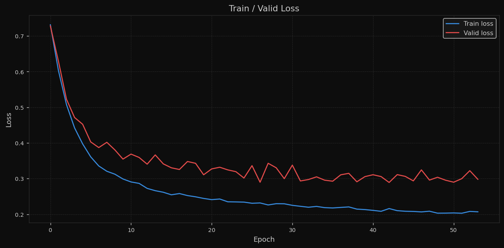
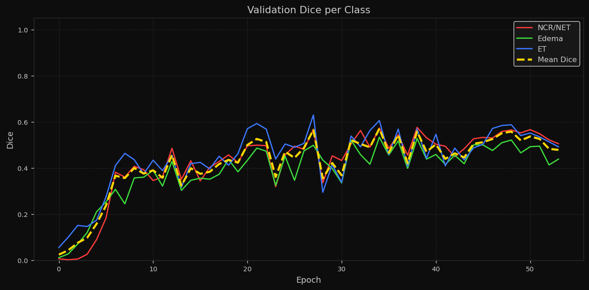
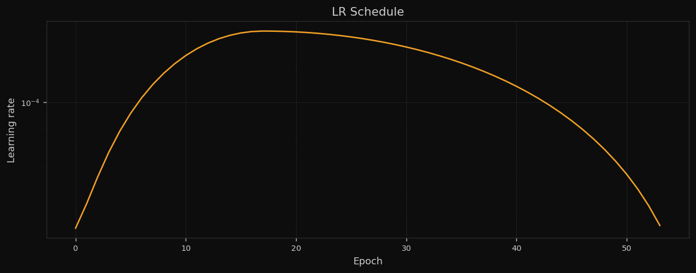
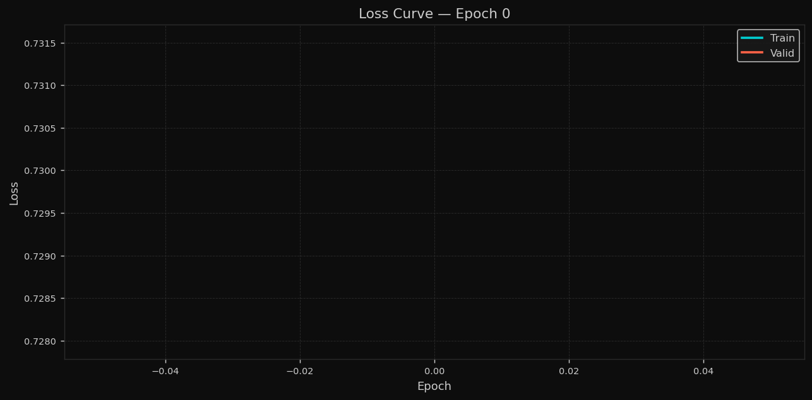
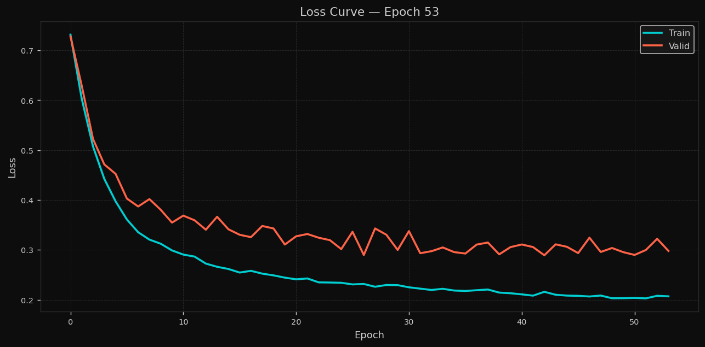
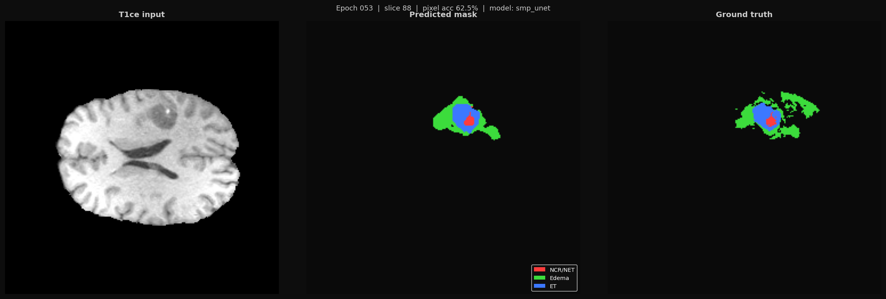
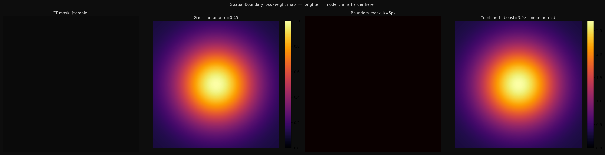
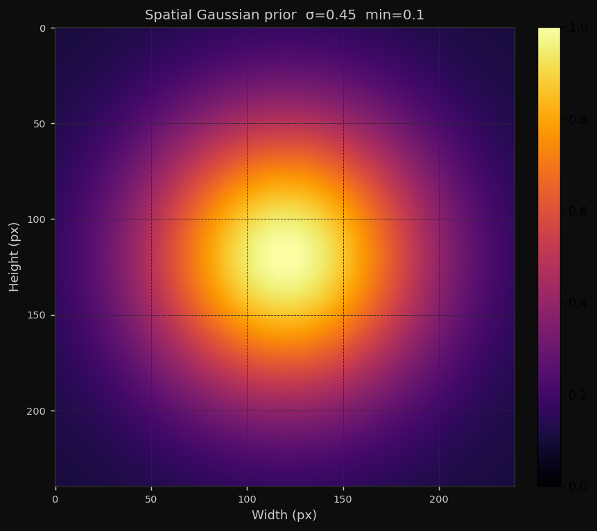

# CANcer - Brain Tumor Segmentation Project

This repository trains and evaluates brain tumor segmentation models (including SMPUNet UnetPlusPlus with EfficientNet-B5 encoder) and provides a desktop GUI for loading checkpoints and visualizing predictions.

## Project Explanation

This project predicts tumor regions in brain MRI slices/volumes using semantic segmentation.

Input:

- MRI volume slices (multi-modal channels)

Output:

- Per-pixel class prediction mask with 4 classes:
1. Background
2. NCR/NET
3. Edema
4. ET

Why this project is useful:

- It supports both model training and practical visual inspection.
- It includes metrics, curves, and per-epoch image previews so you can track model quality over time.
- The GUI helps inspect raw data and prediction behavior slice-by-slice.

## Core Training Idea

The training setup combines:

- A segmentation backbone (for run_002: SMPUNet / UnetPlusPlus / EfficientNet-B5)
- Multi-term loss (Dice + Focal/CE + Lovasz, with spatial-boundary weighting)
- Per-epoch metric logging and visual tracking
- Saved artifacts for quality inspection across epochs

In simple terms, each epoch does this:

1. Train model weights on train split
2. Validate on valid split
3. Save losses and Dice metrics to history
4. Save plots and mask previews for visual progress checks

Training pipeline entry points:

- [code/main.py](code/main.py)
- [code/train.py](code/train.py)
- [code/loss.py](code/loss.py)

## Epoch Images and Logs

Main training logs and plots are stored in:

- [code/runs/run_002/logs](code/runs/run_002/logs)
- [code/runs/run_002/logs/history.csv](code/runs/run_002/logs/history.csv)
- [code/runs/run_002/logs/loss_curve.png](code/runs/run_002/logs/loss_curve.png)
- [code/runs/run_002/logs/dice_curve.png](code/runs/run_002/logs/dice_curve.png)
- [code/runs/run_002/logs/lr_curve.png](code/runs/run_002/logs/lr_curve.png)

Rendered training curves:

Per-epoch loss snapshots are in the same folder:

- [code/runs/run_002/logs/loss_epoch_000.png](code/runs/run_002/logs/loss_epoch_000.png)
- ...
- [code/runs/run_002/logs/loss_epoch_053.png](code/runs/run_002/logs/loss_epoch_053.png)

Sample epoch snapshots:

Mask previews per epoch:

- [code/runs/run_002/results/mask_previews](code/runs/run_002/results/mask_previews)

Latest mask preview example:

Spatial weighting diagnostics:

- [code/runs/run_002/results/spatial_weights/combined_example.png](code/runs/run_002/results/spatial_weights/combined_example.png)
- [code/runs/run_002/results/spatial_weights/gaussian_prior.png](code/runs/run_002/results/spatial_weights/gaussian_prior.png)

Rendered spatial weighting diagnostics:

## run_002 Results Summary

Source file: [code/runs/run_002/logs/history.csv](code/runs/run_002/logs/history.csv)

- Total epochs: 54 (epoch 0 to 53)
- Total logged training time: about 17.53 hours
- Best mean Dice: 0.570782 at epoch 34
- Final epoch mean Dice: 0.478558 at epoch 53

Top validation epochs by mean Dice:

| Epoch | Mean Dice | NCR/NET Dice | Edema Dice | ET Dice |
|---|---:|---:|---:|---:|
| 34 | 0.570782 | 0.573452 | 0.533302 | 0.605593 |
| 27 | 0.565107 | 0.567137 | 0.498662 | 0.629521 |
| 38 | 0.558000 | 0.575968 | 0.528141 | 0.569892 |
| 48 | 0.557800 | 0.564938 | 0.521213 | 0.587250 |
| 47 | 0.550730 | 0.558408 | 0.509636 | 0.584147 |

Final logged epoch (53):

- Train loss: 0.206858
- Valid loss: 0.297958
- Mean Dice: 0.478558

## GUI

GUI entry point:

- [code/run_gui.py](code/run_gui.py)

Main GUI modules:

- [code/gui/main_window.py](code/gui/main_window.py)
- [code/gui/viewer_3d.py](code/gui/viewer_3d.py)
- [code/gui/model_tester.py](code/gui/model_tester.py)

### How GUI works

Typical workflow:

1. Open GUI from [code/run_gui.py](code/run_gui.py)
2. Select run folder and checkpoint
3. Click Load Model
4. Choose split and volume in Data Selection
5. Click Process Selected Data
6. Inspect slices in the main panel and mesh in the second mesh window

### How slice works in GUI

- Slice index controls which axial slice is shown in raw view.
- You can change slice by:
1. Slice slider
2. Mouse wheel (one notch = one slice)
3. Arrow keys and PageUp/PageDown (one key press = one slice)
- In 3D Mesh mode:
1. Main panel still shows raw slice view
2. Mesh is shown in a separate window

### GUI result display

- Raw view: normalized MRI slice for visibility
- Prediction mesh: class-colored 3D surfaces
- Ground truth mode: uses label volume instead of prediction
- Background class is semi-transparent so internal structures remain visible

### Accuracy testing in GUI

- Test Model Accuracy computes:
1. Overall Dice
2. Per-class Dice
3. Accuracy, Precision, Recall, F1
- Metrics are computed by [code/gui/model_tester.py](code/gui/model_tester.py)

## Results Explanation

How to read key outputs:

- [code/runs/run_002/logs/history.csv](code/runs/run_002/logs/history.csv): numeric metrics per epoch
- [code/runs/run_002/logs/loss_curve.png](code/runs/run_002/logs/loss_curve.png): train/valid loss trend
- [code/runs/run_002/logs/dice_curve.png](code/runs/run_002/logs/dice_curve.png): class Dice trend
- [code/runs/run_002/results/mask_previews](code/runs/run_002/results/mask_previews): visual prediction previews over epochs

Interpreting values:

- Higher Dice is better (closer overlap with ground truth)
- Lower loss is better
- A gap where training improves but validation degrades suggests overfitting

## License

This project is licensed under the MIT License. See [LICENSE](LICENSE).
